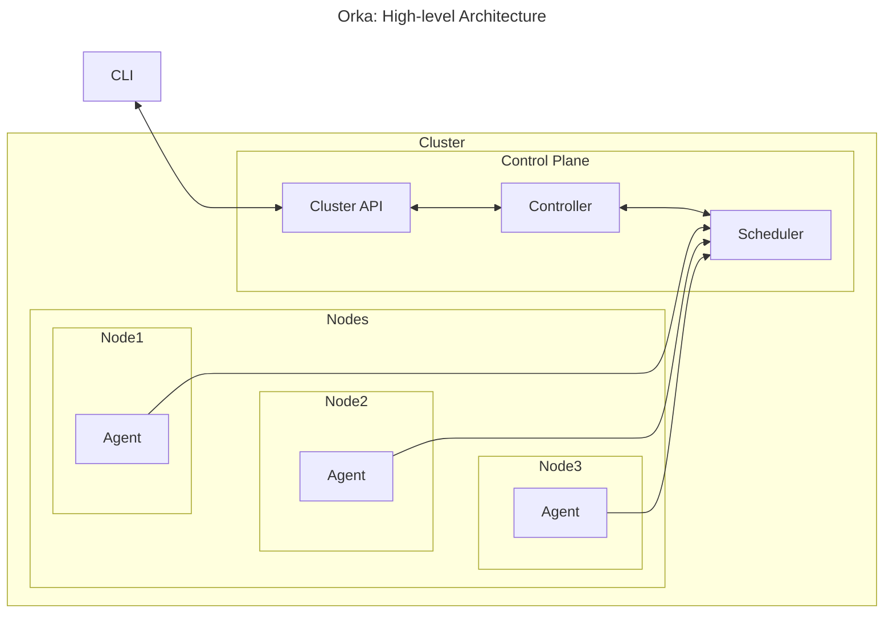

# orkactl

## High Level Architecture

As the cluster CLI, `orkactl` communicates with the Cluster REST API to send requests to it and retrieve cluster information back from it.



### Out of scope 

- Ressource limitation  
- Multi tenant
- Scalability
- High Availability
- Upgradable
- Monitoring


## Transport Protocol

As a CLI, our component interface will communicate to the ClusterAPI using the HTTPS Protocol.


`orkactl` will contact the API through the following HTTP Requests:

- `GET /workload` returns all workloads
- `GET /workload/:id` returns workload of id `:id`
- `POST /workload` creates a new workload
- `DELETE /workload/:id` deletes an existing workload of id `:id`
- `GET /instance` returns all instances
- `GET /instance/:id` returns instances of id `:id`
- `POST /instance` creates a new instance
- `DELETE /instance/:id` deletes an existing instance of id `:id`
- `DELETE /instance/:id/force` forcefully deletes an existing instance of id `:id`

## CLI

`orkactl` provides the following set of commands:

**Optional arguments** are represented between `[]`

**Parameter arguments** are represented between `<>`

*Configurable properties commands:*
- `orkactl config set <configResource> <value>`
- `orkactl config get <configResource>`

*Workload commands:*
- `orkactl create workload -f work.yaml`
- `orkactl delete workload <workload-id>`
- `orkactl get workload [--id <workload-id>]`

*Instance commands:*
- `orkactl create instance <workload-id>`
- `orkactl delete instance <instance-id> [--force]`
- `orkactl get instance [--id <instance-id>]`


## Workload description

The workload will be presented in a yaml file, and is converted into the JSON format before communication with the controller.
 
### Compute workloads

```yaml
version: 1                     # Default to last supported version 
workload:
    kind: container            # "container", "bare-metal" 
    name: postgres             
    network:
        - "network_name_1"
        - "mfa_network"
    environment:
        - key=value
        - key2=value2
        - keyX=valueX

    registry: ghcr | dockerhub # Default to dockerhub, optional
    image: postgres:15

```

### Network workloads

```yaml
version: 1
workload:
    kind: network               
    name: mfa_network           # Unique across all tenants
    allowService:               # Limit which services can connect to the network
        - workload_name 
    egress:
        - 10.0.0.0:
            mask: "32"
            ports: 
                - "80-90"       # A range of ports, 80 to 90 included
                - "3000"
    ingress:
        - 10.0.0.0:
            mask: "24"
            ports:
                - "80-90"
                - "3000"

```


#### Network default behaviors

- When `allowService` is missing, any service is allowed to connect to the network.
- When `egress` or `ingress` is missing, nothing is blocked.
    - When `mask` is missing, `32` is assumed.
    - When `ports` is missing every port is assumed.


_**Note:** The applications will be available under a unique domain name: <workload_name>.<network_name>_

## Configuration

`orkactl` users can configure the CLI through a configuration file, located by default at `$HOME/.config/orka/config.yaml`.

Any command option passed through `orkactl` overrides the corresponding configuration file settings.

### Configurable properties

The following `orkactl` properties can be set though the configuration file:

| Property Key | Description                         | Optional | Default Value      |
|--------------|-------------------------------------|----------|--------------------|
| `apiUrl`     | The URL to the Cluster API instance | Yes      | `http://localhost` |
| `apiPort`    | The port to the Cluster API instance| Yes      | `3000`             |


### Configuration File reference

The configuration file is stored as a structured yaml:
```yaml
apiUrl: "string"
apiPort: number
```
