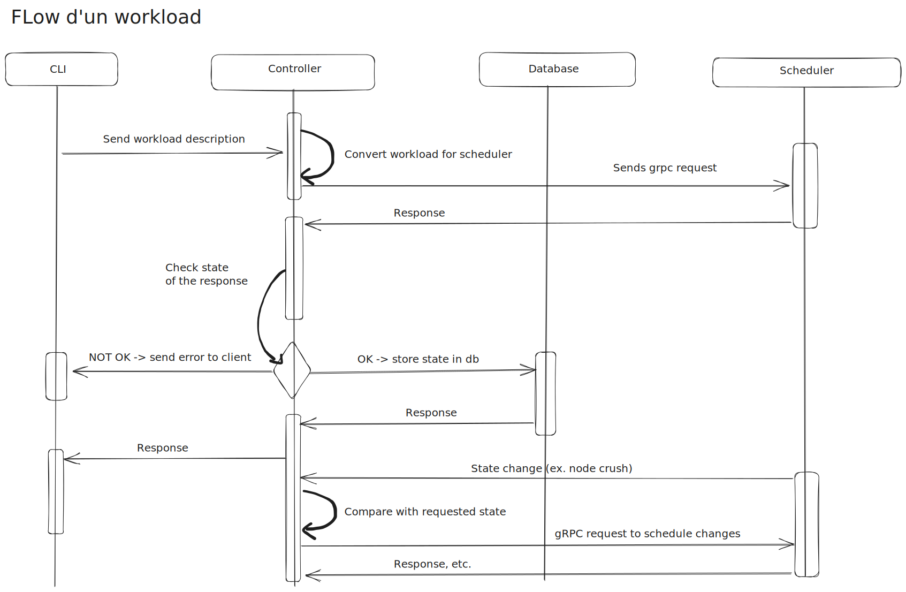

# Cluster Controller

The Cluster Controller is an intermediary between the client and scheduler, its main task is to compare two states: the one requested by the client and the existing one reported by the scheduler and saved in the database. Based on the comparison results, the controller sends requests to the scheduler API in order to transform the current state into the requested one.

### Services provided:

HTTP API (OpenAPI 3.0 compliant) to connect with CLI
gRPC client and API for the scheduler
DATABASE access and control

## Scope

The Cluster Controller is responsible for:
Receiving requests from the CLI (Controller External API)
Receive updates on the instances status from scheduler (Controller Internal API)
Store current cluster state in the database
Constantly compare current state with the state requested by client
Make requests to scheduler based on the comparison results

### Out of scope

The Cluster Controller is NOT responsible for:
Scheduling instances
Handling connection with agents
Communicating with anything other than CLI, Scheduler and database

…

## Architecture

## API

Task: Specify the cluster v0 HTTP API (OpenAPI 3.0 compliant)
**POST** /api/v0/workloads ?
Create a workload (only one workload type for now)
**GET** /api/v0/workloads/:id
Get a workload by id
**DELETE** /api/v0/workloads/:id
Delete a workload by id
**GET** /api/v0/workloads/all
List all workloads
**POST** /api/v0/instances
Create, get and delete workload instances
**GET** /api/v0/instances/:id
Get an instance by id
**DELETE** /api/v0/instances/:id
Delete an instance by id
**GET** /api/v0/instances/all
List all instances
