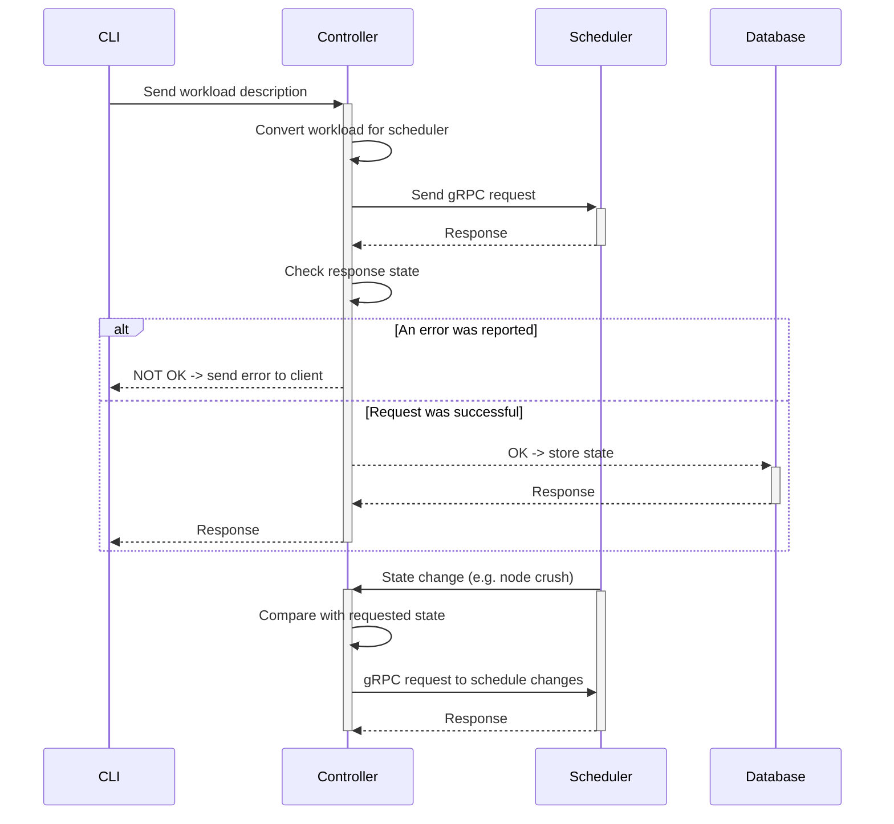

# Cluster Controller

The Cluster Controller is an intermediary between the client and scheduler, its main task is to compare two states: the one requested by the client and the existing one reported by the scheduler and saved in the database. Based on the comparison results, the controller sends requests to the scheduler API in order to transform the current state into the requested one.

### Services provided:

HTTP API (OpenAPI 3.0 compliant) to connect with CLI
gRPC client and API for the scheduler

### Scope

The Cluster Controller is responsible for:

- Receiving requests from the CLI (Controller External API)

- Receive updates on the instances status from scheduler (Controller Internal API)
- Store current cluster state in the database
- Compare current state with the requested one when an update request is received from a client or when the scheduler reports a change in the cluster state.
- Make requests to scheduler based on the comparison results

### Out of scope

The Cluster Controller is NOT responsible for:

- Scheduling instances
- Handling connection with agents
- Communicating with anything else than the CLI and the Scheduler

## Architecture

## API

- External API: A RESTful API which accepts CLI's HTTP requests.
  [api_definition](./api_definition.yaml)
- Internal API: A gRPC API accepting requests from scheduler (allows scheduler to inform controller about state changes).
  [scheduler.proto](./scheduler.proto)
