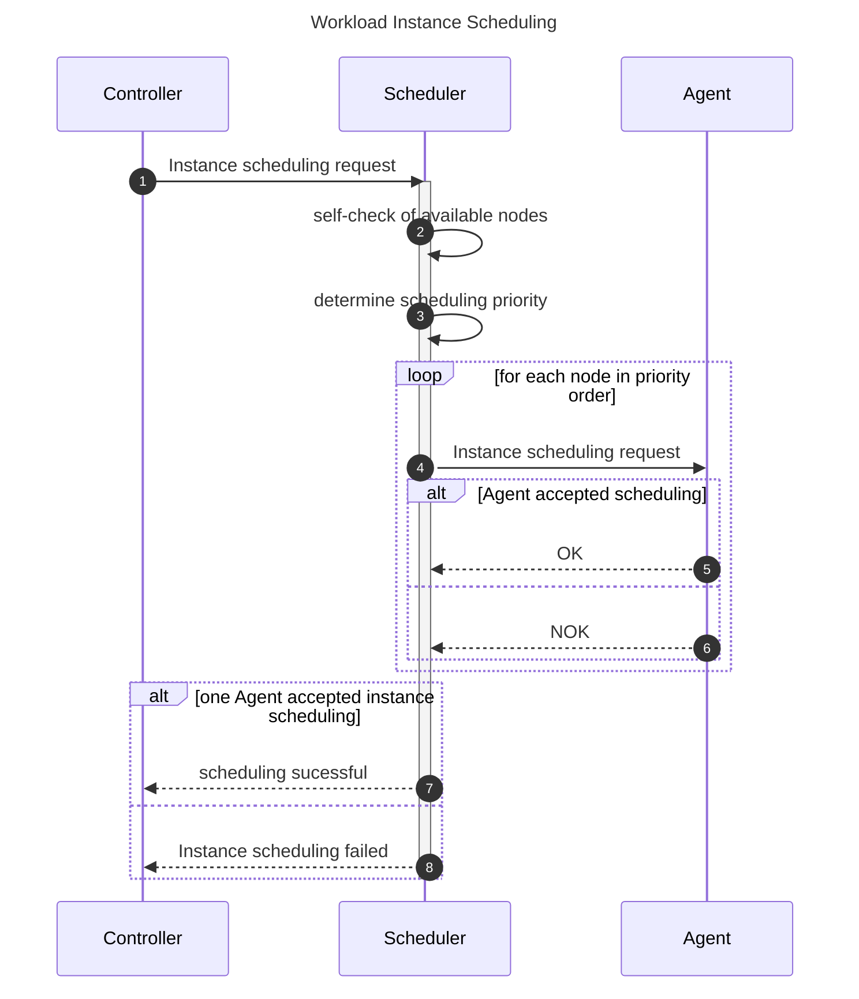
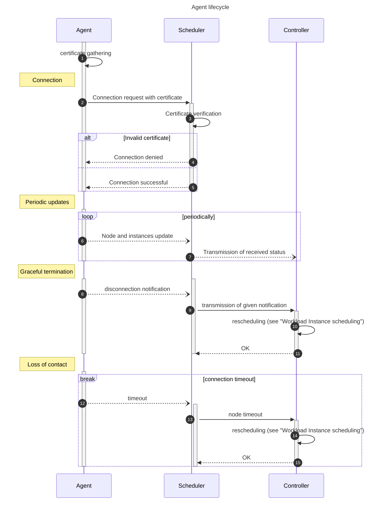

# Orka - Cluster Scheduler

## Requirements

### Service provided

The Scheduler is responsible for scheduling workloads across the cluster nodes.
It is the interface between the Controller and the Agent.

### Scope

The Scheduler is responsible for:

- Scheduling and re-scheduling `orka` workloads
- Nodes and Workload Instances status updates
    - Received from the Agents
    - Sent to the Controller
- Handling of Agent connection
    - The Scheduler is responsible for accepting new connections
    - Secure connection must be made between Agent and Scheduler

### Out of Scope

- Workload management (creation/update/deletion)
- Node management (connection/disconnection)
    - The Scheduler is only receiving status updates
    - The Agent is responsible for connecting to and disconnecting from the Scheduler
- Rescheduling workloads automatically in case of an Agent disconnection
    - Workload lifecycle management is the Controller's responsibility

## High Level Architecture

## API

The Scheduler can be interacted with using gRPC. It exposes two APIs: the Controller side, and the Agent side.

Each API is defined in its gRPC `.proto` file:

- [`controller.proto`](./controller.proto)
- [`agent.proto`](./agent.proto)

