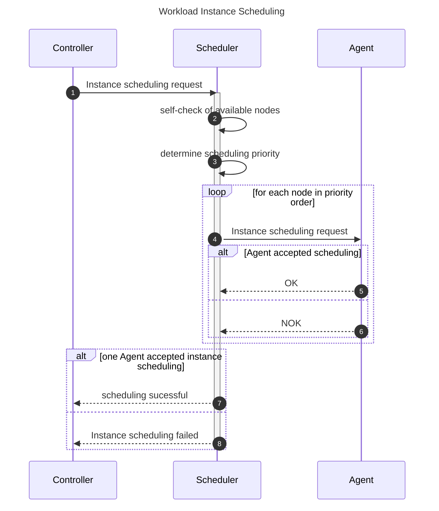
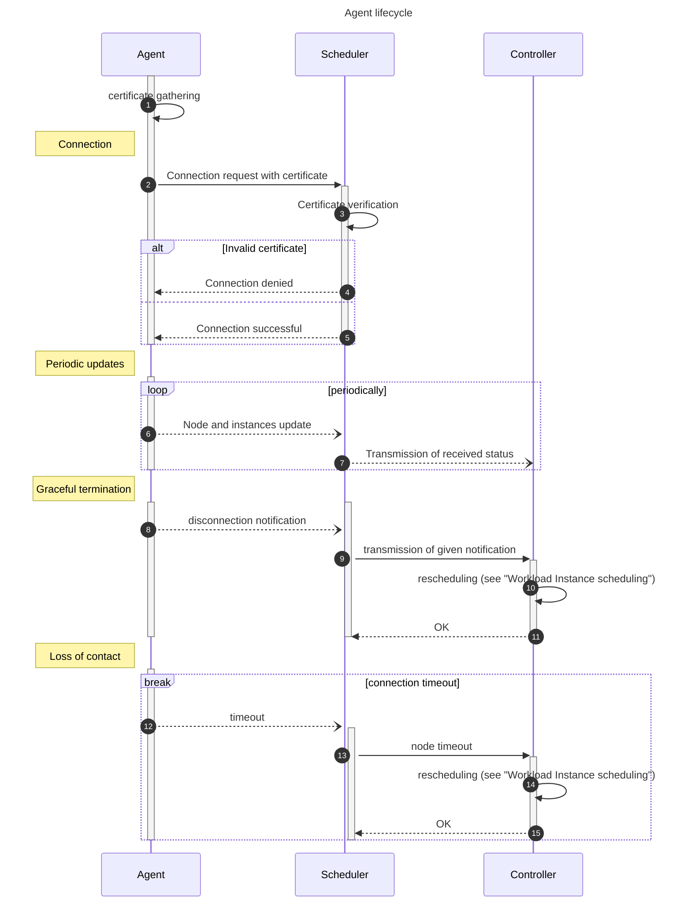

# Orka - Cluster Scheduler

## Requirements

### Service provided

The Scheduler is responsible for the scheduling of nodes and workloads.
It is the interface between the Controller and the Agent.

### Scope

The Scheduler is reponsible for:

- Sending workload scheduling/re-scheduling
    - Re-scheduling can happen upon Agent disconnection
- Nodes and Workload Instances status updates
    - received from the Agents
    - sent to the Controller
- Handling of Agent connection
    - the Scheduler is responsible for the handshake
    - secure connection should be made between Agent and Scheduler

The Scheduler is NOT responsible for:

- Workload management (creation/update/deletion)
- Node management (connection/disconnection)
    - the Scheduler is only receiving status updates
    - the Agent is responsible for its connection and disconnection to the Scheduler
- Rescheduling workloads automatically in case of an Agent disconnection
    - this is the Controller's responsbility
    - the Controller needs to call the Scheduler with a reschedule order

## High Level Architecture

## API

The Scheduler is interactable through gRPC. It exposes two APIs: the Controller side, and the Agent side.

Each API is defined in its gRPC `.proto` file:

- [`controller.proto`](./controller.proto)
- [`agent.proto`](./agent.proto)

